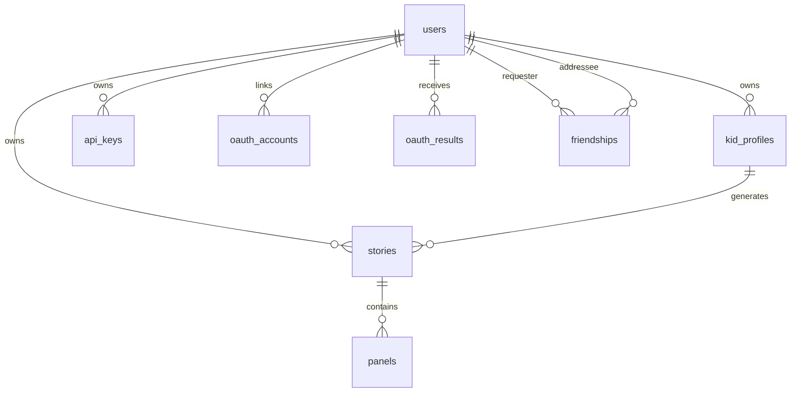

*This project has been created as part of the 42 curriculum by czhu, xinzhang, ymiao, auzou.*

---

# ft_transcendence — Funova

An AI-powered comic book generator for children. Authenticated users build a kid character profile (appearance, archetype, dream, art style), and the app uses Google's Gemini API to produce a fully illustrated short comic — title, foreword, 10 panels, and cover art — with a per-user gallery to revisit, edit, and share past stories.

## Description

**Funova** turns a short character wizard into a finished, illustrated comic book. The frontend streams the title and foreword character-by-character while the backend generates panel images in parallel, then saves the result to a per-user gallery.

### Key Features

- **AI story generation** — Gemini text + image generation, NDJSON streaming for the title/foreword, parallel preview-image generation, "Magic Revision" natural-language panel editing.
- **Skeuomorphic comic reader** — page-turn animation, read-aloud (Web Speech API), 6-language UI (English, French, Spanish, Chinese, Japanese, Arabic with full RTL).
- **Account system** — email/password signup, Google OAuth 2.0, profile + avatar upload, friend requests with online status.
- **Public REST API** — API-key authenticated, rate-limited, OpenAPI-documented endpoints for third-party integrations.
- **Production-grade ops** — HTTPS via nginx, Prometheus + Grafana + Alertmanager monitoring, automated SQLite backups, health/status page.

---

## Instructions

### Prerequisites

- **Docker** ≥ 24.x and **Docker Compose** v2
- A **Google Gemini API key** (get one at https://aistudio.google.com/apikey)
- Modern Chromium-based browser (Chrome) — required for the Web Speech API
- Free TCP port `8443` (HTTPS, mapped to the nginx container)

For local development outside Docker:
- **Python ≥ 3.13** with [`uv`](https://github.com/astral-sh/uv)
- **Node.js ≥ 20** with npm (frontend dependencies such as Vite and TypeScript are installed by `npm install`)
- Free TCP port `3000` (Vite dev server)

### Setup

```bash
git clone <this-repo>
cd <this-repo>
cp .env.example .env       # then fill in the required secrets below
```

### Environment Variables

| Variable | Description | Required |
|----------|-------------|----------|
| `GEMINI_API_KEY` | Google Gemini API key | **Yes** |
| `JWT_SECRET_KEY` | Secret used to sign JWT access tokens | **Yes** |
| `SESSION_SECRET_KEY` | Secret used to sign backend session cookies | **Yes** |
| `GOOGLE_CLIENT_ID` | OAuth 2.0 client ID (for Google login) | Optional |
| `GOOGLE_CLIENT_SECRET` | OAuth 2.0 client secret | Optional |
| `GOOGLE_REDIRECT_URI` | OAuth callback URL (Docker default: `https://localhost:8443/api/auth/oauth/google/callback`) | Optional |
| `VITE_API_BASE_URL` | Backend URL seen by browser for local backend-only dev (default: same origin in Docker) | No |
| `FRONTEND_URL` | CORS allowed origin (Docker default: `https://localhost:8443`; local dev default: `http://localhost:3000`) | No |
| `DB_PATH` | SQLite database file path (default: `wondercomic.db`) | No |
| `BCRYPT_ROUNDS` | Password hashing cost factor, 4-31 (default: `12`) | No |
| `BACKUP_INTERVAL_SECONDS` | Backup-worker interval in seconds (default: `86400`) | No |
| `PUBLIC_API_RATE_LIMIT_REQUESTS` | Public API requests allowed per key per window (default: `60`) | No |
| `PUBLIC_API_RATE_LIMIT_WINDOW_SECONDS` | Public API rate-limit window in seconds (default: `60`) | No |
| `ADMIN_PROMOTION_SECRET` | Local secret required by `backend/scripts/promote_admin.py` | No |
| `RESTORE_BACKUP_SECRET` | Local secret required by `backend/scripts/restore_backup.py` | No |
| `GRAFANA_ADMIN_PASSWORD` | Grafana admin password for the Docker Compose monitoring stack | **Yes** |

> Never commit `.env` — it is git-ignored. Only `.env.example` is tracked.

### Run

```bash
make up          # docker compose up --build -d
```

Then open **https://localhost:8443** in Chrome (accept the self-signed certificate on first visit).

Useful commands:

```bash
make down        # stop all services
docker compose logs -f          # tail all service logs
docker compose logs -f backend  # tail backend logs only
```

See [Development Guide](documentation/development.md) for non-Docker workflows and pre-push checks.

---

## Team Information

| Login | Role(s) | Responsibilities |
|-------|---------|-----------------|
| **czhu** | Product Owner + Backend Developer | Feature prioritization and scope, user management & authentication, public API module |
| **xinzhang** | Project Manager + Frontend Developer | Team coordination, sprint facilitation, frontend web modules (design system, notifications), accessibility (i18n + RTL) |
| **ymiao** | Tech Lead + AI Developer | Architecture decisions, code review, Gemini LLM integration, voice/speech module |
| **auzou** | DevOps Developer | Docker Compose stack, nginx HTTPS, Prometheus/Grafana monitoring, health checks and automated backups |

---

## Project Management

- **Meetings** — In-person sync every Saturday + asynchronous discussion on Discord throughout the week.
- **Task tracking** — GitHub Issues and Pull Requests; module checklist maintained in [`module_checklist.md`](module_checklist.md).
- **Code review** — Every change goes through a GitHub PR reviewed by at least one teammate before merge.
- **Communication** — Private Discord server for daily coordination, screenshots, and quick questions.
- **Branch strategy** — Trunk-based with short-lived feature branches (`feat/*`, `fix/*`, `docs/*`) merged to `main` via PR.

---

## Technical Stack

| Layer | Technology | Why this choice |
|-------|-----------|-----------------|
| Frontend framework | React 19 + Vite 6 + TypeScript 5.8 | Fast HMR, mature component ecosystem, strict typing across the codebase |
| Styling | Tailwind CSS | Utility-first, RTL-friendly with logical properties |
| Backend framework | FastAPI (Python 3.13+) | Async-native, Pydantic v2 validation, automatic OpenAPI docs |
| Database | **SQLite** via aiosqlite | Zero-setup, WAL mode for concurrent reads; sufficient for single-node scope and trivial to back up by file copy |
| Auth | JWT (PyJWT) + bcrypt + Authlib (OAuth) | Stateless tokens that work across containers without shared session storage |
| AI | Google Gemini API (`google-genai`) | One SDK for both text generation (story scripts) and image generation (panels + cover) |
| HTTPS | nginx (TLS termination + reverse proxy) | Mandatory per subject; offloads TLS from FastAPI/Vite |
| Containerization | Docker Compose | Single-command startup, required by the subject |
| Monitoring | Prometheus + Grafana + Alertmanager + node_exporter | Industry-standard stack; provisioned dashboards committed to repo |
| i18n | i18next | Mature library; supports nested keys, pluralization, RTL handoff |

### Why these choices

- **FastAPI over Django/Flask** — Native async (needed for Gemini streaming), Pydantic v2 built in, auto-generated OpenAPI docs serve as our public-API documentation for free.
- **SQLite over Postgres** — The project runs as a single Compose stack on one machine. SQLite WAL mode handles our read concurrency, the database is a single file (trivial backups), and there's no separate DB process to operate. If the project ever needs horizontal scale, the schema and aiosqlite layer port cleanly.
- **JWT over server sessions** — Stateless tokens cross the nginx ↔ FastAPI boundary without a shared session store and make the public-API key flow consistent with the user-auth flow.
- **Gemini over OpenAI/Stable Diffusion** — One SDK covers both modalities, exponential-backoff retry is straightforward, and the streaming API powers the title/foreword typewriter effect.

See [Architecture](documentation/architecture.md) for full system topology, sequence diagrams, and the database schema.

---

## Database Schema

The project uses SQLite. User-owned data is scoped through `users.id`, and foreign keys use `ON DELETE CASCADE` so deleting a user removes their profiles, stories, panels, OAuth identities, API keys, and friendships.



| Table | Key fields | Purpose |
|-------|------------|---------|
| `users` | `id INTEGER PK`, `email TEXT UNIQUE`, `username TEXT UNIQUE`, `password_hash TEXT`, `avatar_path TEXT`, `is_online BOOLEAN`, `is_admin BOOLEAN` | Authenticated users and profile metadata |
| `friendships` | `requester_id INTEGER FK`, `addressee_id INTEGER FK`, `status TEXT CHECK(pending/accepted/rejected)` | Friend requests and accepted friendships |
| `oauth_accounts` | `user_id INTEGER FK`, `provider TEXT`, `provider_user_id TEXT`, `provider_email TEXT` | Linked Google OAuth identities |
| `oauth_results` | `code TEXT PK`, `user_id INTEGER FK`, `expires_at TIMESTAMP` | Short-lived OAuth handoff codes |
| `kid_profiles` | `user_id INTEGER FK`, `name TEXT`, `gender TEXT`, `skin_tone TEXT`, `hair_color TEXT`, `eye_color TEXT`, `favorite_color TEXT`, `dream TEXT`, `archetype TEXT`, `art_style TEXT`, `language TEXT` | Character profiles used to generate stories |
| `stories` | `user_id INTEGER FK`, `kid_profile_id INTEGER FK`, `title TEXT`, `foreword TEXT`, `character_description TEXT`, `cover_image_prompt TEXT`, `cover_image_path TEXT`, `visibility TEXT`, `is_unlocked BOOLEAN` | Saved comic stories and sharing state |
| `panels` | `story_id INTEGER FK`, `panel_order INTEGER`, `text TEXT`, `image_prompt TEXT`, `image_path TEXT`, `UNIQUE(story_id, panel_order)` | Ordered comic panels for each story |
| `api_keys` | `user_id INTEGER FK`, `name TEXT`, `key_prefix TEXT UNIQUE`, `key_hash TEXT UNIQUE`, `is_active BOOLEAN`, `last_used_at TIMESTAMP` | Public API credentials and revocation state |

The authoritative DDL and startup migrations live in `backend/db/database.py`; a fuller schema explanation is available in [Architecture](documentation/architecture.md#database-schema).

---

## Features List

| Feature | Description | Owner(s) |
|---------|-------------|----------|
| Email/password signup + login | bcrypt-hashed passwords, JWT issued on success | czhu |
| Google OAuth 2.0 | Sign-in via Google, account linking, callback page | czhu |
| Profile management | View/edit username, avatar upload | czhu |
| Friends system | Friend requests (send/accept/reject), online status indicator | czhu |
| Public API | 5 API-key-authenticated, rate-limited, OpenAPI-documented endpoints; per-user key management UI | czhu |
| Character wizard | Multi-step kid profile form (name, appearance, archetype, dream, art style) | xinzhang |
| Story script generation | Gemini text generation, NDJSON streaming for title/foreword typewriter | ymiao |
| Panel image generation | Per-panel Gemini image generation with consistent character visual guide | ymiao |
| Magic Revision | Natural-language re-generation of a single panel image | ymiao |
| Comic reader | Skeuomorphic page-turn book viewer with read-aloud control | xinzhang + ymiao |
| Story gallery | Browse, re-read, and delete past stories | xinzhang |
| Read-aloud (TTS) + voice prompts (STT) | Web Speech API integration for reading and dictation | ymiao |
| Custom design system | 12 reusable React components (typography, buttons, cards, archetype icons) | xinzhang |
| Notification system | `sonner`-based toasts wired across all user flows (34 call sites across 7 files) | xinzhang |
| Internationalization | 6 languages: en/fr/es/zh/ja/ar; runtime language switcher | xinzhang |
| RTL support | Arabic translation, logical-property CSS, ratcheting static audit, direction-aware UI | xinzhang |
| HTTPS via nginx | TLS-terminating reverse proxy in Docker Compose | auzou |
| Prometheus + Grafana monitoring | `/metrics` endpoint, custom counters, provisioned dashboard, Alertmanager rules | auzou |
| Health check + status page | `GET /health`, in-app status UI, automated SQLite backups (7-day rotation) | auzou |
| Privacy Policy + Terms of Service | Static pages, footer-linked | xinzhang |

---

## Modules

**Target: 14 mandatory points.** We implemented **17 points** so 1 Major + 1 Minor can be rejected at evaluation without dropping below the bar.

| # | Category | Module | Type | Pts | Owner |
|---|----------|--------|------|-----|-------|
| 1 | Web | Use a framework for both frontend and backend | Major | 2 | xinzhang + ymiao |
| 2 | Web | Public API | Major | 2 | czhu |
| 3 | Web | Notification system | Minor | 1 | xinzhang |
| 4 | Web | Custom design system | Minor | 1 | xinzhang |
| 5 | Accessibility | Multiple languages (i18n) | Minor | 1 | xinzhang |
| 6 | Accessibility | RTL language support | Minor | 1 | xinzhang |
| 7 | User Management | Standard user management & authentication | Major | 2 | czhu |
| 8 | User Management | OAuth 2.0 (Google) | Minor | 1 | czhu |
| 9 | AI | LLM system interface (Gemini text + image) | Major | 2 | ymiao |
| 10 | AI | Voice / speech integration | Minor | 1 | ymiao |
| 11 | DevOps | Prometheus + Grafana monitoring | Major | 2 | auzou |
| 12 | DevOps | Health check + status page + automated backups | Minor | 1 | auzou |

**Point breakdown:** 5 Major × 2 + 7 Minor × 1 = **17 pts**.

### Justifications and implementation notes

1. **Framework — Major.** React 19 + Vite + TypeScript on the frontend; FastAPI (Python 3.13) + Pydantic v2 on the backend. Both go beyond raw HTML/Node — strict typing, async I/O, automatic OpenAPI generation.

2. **Public API — Major.** Five third-party endpoints under `backend/routers/public_stories.py`, authenticated by `X-API-Key` header (`backend/public_api_auth.py`), per-key fixed-window rate limiting (`backend/services/rate_limit.py`), JWT-protected key management UI at `/api/api-keys`, and OpenAPI docs at `/docs`. See [Public API Usage](documentation/public_api_usage.md).

3. **Notification system — Minor.** `sonner` v2 wired into 7 files across auth, profile, friends, gallery, and story flows (34 toast call sites); covers success, error, and info states with consistent styling.

4. **Custom design system — Minor.** 12 reusable React components in `frontend/components/design-system/`: 4 typography (`Typography`, `Heading`, `Text`, `Label`), 4 sketchy form/layout primitives (`SketchyButton`, `SketchyCard`, `SketchyInput`, `SketchyTextarea`), 4 archetype icons (`Explorer`, `Inventor`, `Guardian`, `Dreamer`) sharing a typed `IconProps` contract.

5. **Multiple languages — Minor.** Six languages (en, fr, es, zh, ja, ar) implemented with `i18next`. Language switcher in the navbar, full translation files in `frontend/locales/`. Exceeds the 3-language minimum.

6. **RTL support — Minor (Accessibility).** Arabic is fully translated (859 lines). ~130 logical-property class usages (`ms-/me-/ps-/pe-/start-/end-`) across `frontend/app/`, `frontend/components/`, and `frontend/pages/`; a ratcheting static audit (`frontend/tests/i18n/rtlAudit.test.ts`) blocks new physical-side classes; `getDirectionalArrow()` flips arrows; `i18n.on('languageChanged')` updates `<html dir>` + `<html lang>` for seamless switching.

7. **Standard user management — Major.** JWT signup/login (`backend/routers/auth.py`), profile edit + avatar upload (`backend/services/avatar_upload.py`), full friend request flow (`backend/routers/friend.py`), online status tracking. All side-effects are user-scoped via the `current_user` dependency.

8. **OAuth 2.0 — Minor (User Management).** Google OAuth in `backend/services/oauth/` (client, account_linking, result_store), `frontend/pages/auth/GoogleOAuthCallbackPage.tsx` on the frontend, `backend/db/crud_oauth.py` for persistence; supports linking an OAuth identity to an existing email/password account.

9. **LLM system interface — Major (AI).** Gemini text + image generation with retry (`backend/llm/gemini_service.py`); story-script streaming via NDJSON (`POST /api/generate/story-script/stream`) drives the live title/foreword typewriter UX. Streaming JSON state machine in `backend/llm/streaming.py` parses partial JSON without a full streaming parser dependency.

10. **Voice / speech — Minor (AI).** Web Speech API integration: `frontend/components/speech/useSpeechSynthesis.ts` (TTS), `frontend/components/speech/useSpeechRecognition.ts` (STT), `frontend/components/StoryReadAloudControl.tsx` for in-book read-aloud. Tests cover the hooks.

11. **Prometheus + Grafana — Major (DevOps).** Full observability stack in `docker-compose.yml`: prometheus, grafana, alertmanager, node_exporter. `/metrics` exposed via `prometheus-fastapi-instrumentator`; custom application metrics in `backend/metrics.py`; provisioned dashboard at `backend/grafana/provisioning/dashboards/wondercomic.json`; alert rules in `alerts.rules.yml` with webhook receiver at `backend/routers/monitoring.py`.

12. **Health check + status page — Minor (DevOps).** `GET /health` (`backend/routers/health.py`); in-app `frontend/pages/status/StatusPage.tsx` shows health + recent backups + manual backup trigger; `backend/db/backup.py` uses the SQLite online-backup API with 7-day rotation; scheduled worker in `backend/backup_worker.py`.

The full module status table lives in [`module_checklist.md`](module_checklist.md).

---

## Individual Contributions

| Login | Contributed | Challenges & how they were overcome |
|-------|-------------|-------------------------------------|
| **czhu** | User management module (signup/login, JWT, profile, avatars, friends), Google OAuth 2.0, Public API module (5 endpoints, API key auth, per-key rate limiter, key management UI), README, project-management coordination as PO. | Designing a public-API key model that reuses the JWT user identity for *managing* keys but is independent at the *request* level — solved by a thin `X-API-Key` dependency that resolves to a `user_id` and feeds the same query layer as the JWT path. |
| **xinzhang** | Frontend application shell, character wizard, comic reader UI, gallery page, design system (12 components), notification system (sonner), full i18n (6 languages) and RTL support (logical properties + ratcheting audit), Privacy/Terms pages. PM coordination. | Retrofitting RTL onto a finished LTR codebase — solved by introducing a static audit test that fails CI when physical-side classes (`ml-`, `pr-`, etc.) are added, so the codebase ratchets toward 100% logical properties without a single big-bang migration. |
| **ymiao** | Architecture and tech-lead reviews, full Gemini integration (text + image), NDJSON streaming intro with custom JSON state machine, Magic Revision panel editing, Web Speech API read-aloud + voice prompts. | Streaming a JSON document character-by-character without pulling in a full streaming JSON parser — solved with a small purpose-built state machine (`backend/llm/streaming.py::StoryIntroStreamer`) that only handles the two top-level string fields we actually need. |
| **auzou** | Docker Compose stack, nginx HTTPS reverse proxy, full Prometheus + Grafana + Alertmanager + node_exporter setup with provisioned dashboards and alert rules, health check endpoint, status page UI, automated SQLite backups with rotation. | Wiring Prometheus to scrape FastAPI and exposing custom metrics without polluting business logic — solved by isolating instrumentation in `backend/metrics.py` and using `prometheus-fastapi-instrumentator` middleware so handlers stay clean. |

---

## Resources

### Major Documentation referenced

- [FastAPI](https://fastapi.tiangolo.com/) and [FastAPI security / OAuth2 with JWT](https://fastapi.tiangolo.com/tutorial/security/oauth2-jwt/)
- [bcrypt](https://github.com/pyca/bcrypt/), [PyJWT](https://pyjwt.readthedocs.io/), [Authlib](https://docs.authlib.org/)
- [React 19](https://react.dev/), [Vite](https://vitejs.dev/), [Tailwind CSS](https://tailwindcss.com/docs), [Framer Motion](https://www.framer.com/motion/), [React Router v7](https://reactrouter.com/)
- [aiosqlite](https://aiosqlite.omnilib.dev/), [SQLite WAL mode](https://www.sqlite.org/wal.html)
- [Google Gemini API (`google-genai`)](https://ai.google.dev/gemini-api/docs)
- [i18next](https://www.i18next.com/) and [react-i18next](https://react.i18next.com/)
- [Web Speech API (MDN)](https://developer.mozilla.org/en-US/docs/Web/API/Web_Speech_API)
- [Prometheus](https://prometheus.io/docs/), [Grafana](https://grafana.com/docs/), [Alertmanager](https://prometheus.io/docs/alerting/latest/alertmanager/)
- [nginx HTTPS configuration](https://nginx.org/en/docs/http/configuring_https_servers.html)
- [Docker Compose reference](https://docs.docker.com/compose/compose-file/)

To see a detailed list, go to [resources.md](./documentation/resources.md)

### AI usage

- **Codex** — used by the team for: scaffold analysis against the subject, gap analysis on module requirements, README and `AGENTS.md` drafting, architecture diagram drafting, exploratory refactor proposals, and pair-style debugging on tricky integration points. Every AI-suggested change was read, understood, and edited by the responsible team member before being committed; no generated code was merged unreviewed.

- **GitHub Copilot** — occasional inline completion during routine boilerplate (TypeScript types, test scaffolds). Not used for design or architectural decisions.

---

## Further documentation

- [Development Guide](documentation/development.md) — local dev, docker commands, pre-push checks, path aliases
- [Architecture](documentation/architecture.md) — system topology, story-generation sequence diagram, frontend layering, full schema, streaming details
- [Public API Usage](documentation/public_api_usage.md) — endpoint reference, API-key flow, rate-limit headers
- [Disaster Recovery](documentation/disaster_recovery.md) — backup restore procedure
- [Module Checklist](module_checklist.md) — current status of every module with implementation evidence

## License

This project is submitted as part of the 42 curriculum and is not intended for production deployment. © 2026 czhu, xinzhang, ymiao, auzou.
