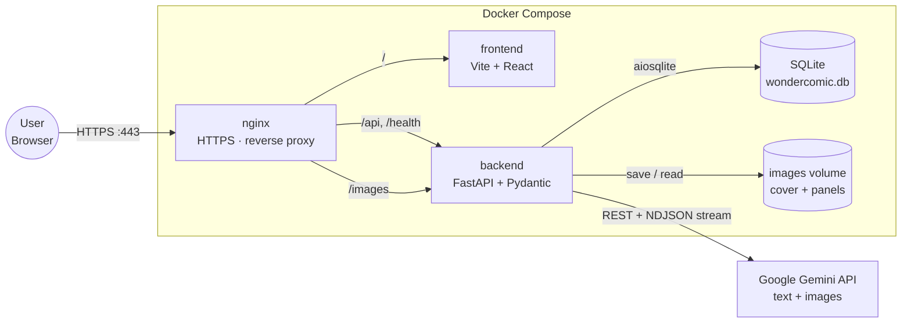
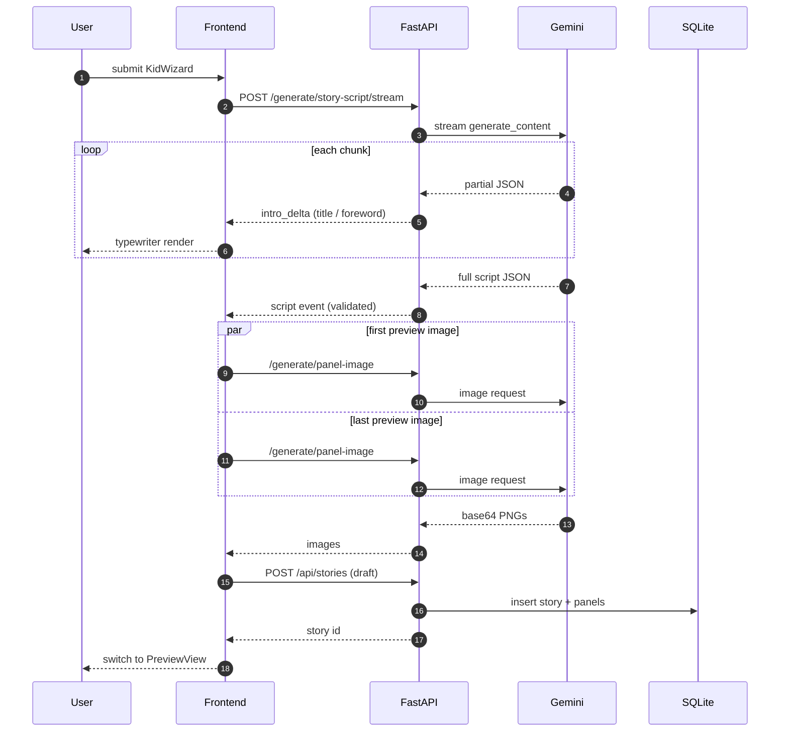
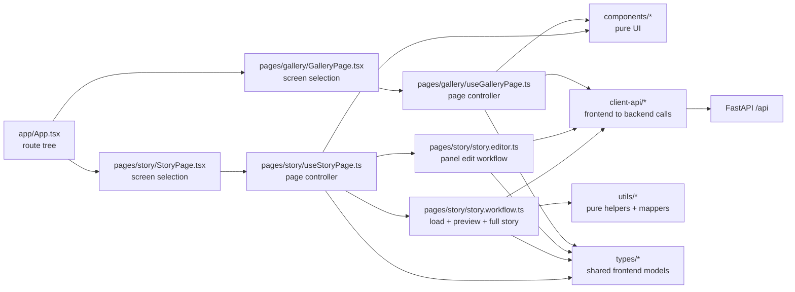
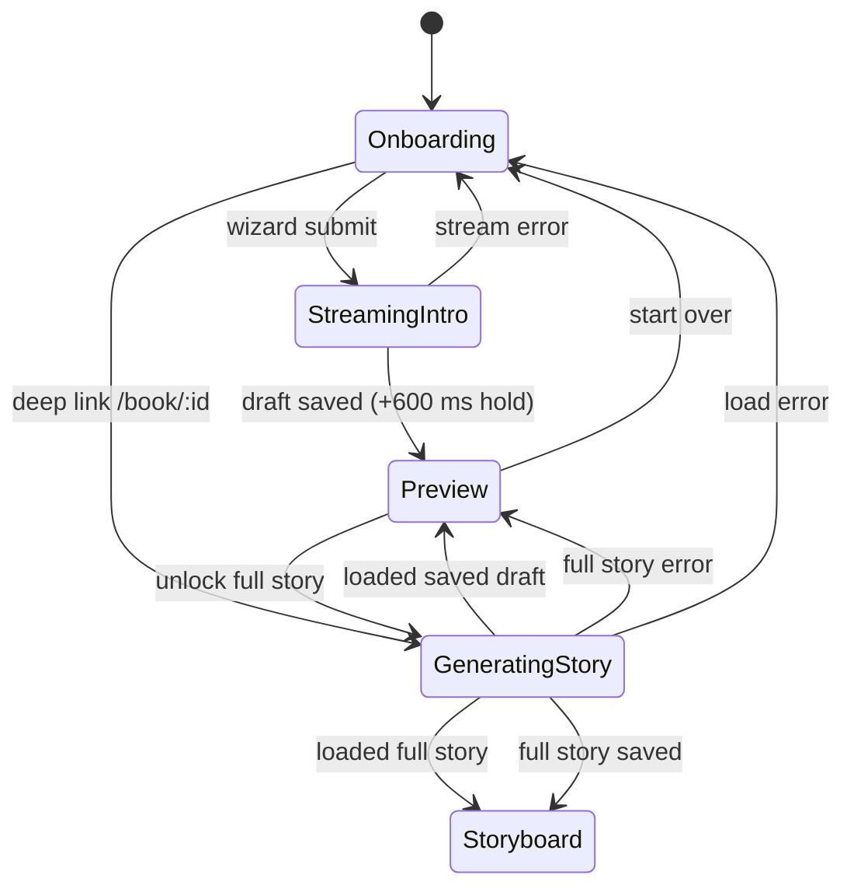

# Architecture

## System Topology

The stack runs as three Docker Compose services behind nginx. nginx terminates TLS and fans requests out by prefix: `/api`, `/health`, and `/images` reach FastAPI, everything else reaches the Vite dev server. FastAPI owns every side effect — SQLite writes, the images volume, and all Gemini calls — so the frontend never talks to external services directly.



## Story Generation Flow

From a completed `KidWizard` to the preview book, the frontend now routes work through the story page controller. `StoryPage` selects the visible screen, `useStoryPage` owns page state and transitions, and `story.workflow.ts` runs the long async steps: stream the intro, generate the first and last preview images in parallel, persist a draft, and later unlock the full story.



## Frontend Layering

The frontend is now organized around explicit boundaries: `app` declares routes, `pages` coordinate feature-level state, `components` stay UI-only, `client-api` owns browser-to-backend communication, and `utils` contains pure helpers and mappers.



Rules enforced by structure:

- `components` render props and emit user intent; they do not call backend APIs directly.
- `pages` are the orchestration layer and are the only place where routing, toasts, and screen transitions are coordinated.
- `client-api` owns HTTP and streaming transport details.
- `utils` stays pure and does not depend on UI or transport.

## Frontend View States

`StoryPage` and `useStoryPage` now split rendering from coordination. `StoryPage` chooses one visual screen from `StoryPageView`, while `useStoryPage` owns the transitions between onboarding, intro streaming, preview loading, and the finished storyboard. There are still two entry points: a fresh visit to `/` starts in `Onboarding`, while a deep link to `/book/:id` first enters `GeneratingStory` and then resolves to `Preview` or `Storyboard` depending on whether the saved story is still a draft.



Notes:

- `StreamingIntro` renders `StoryIntroStream.tsx` and is held on screen for at least 600 ms after the last delta, so the typewriter text does not vanish the instant Gemini finishes.
- `GeneratingStory` is intentionally reused as the single busy state for both deep-link hydration and full-story generation.
- `Storyboard` has no in-place exit transition; navigation leaves the page through React Router and unmounts the story feature.

## Tech Stack

| Layer | Technology | Why |
|-------|-----------|-----|
| Frontend framework | React 19 + Vite 6 + TypeScript 5.8 | Fast HMR, component ecosystem, strong typing |
| Routing | React Router v7 | SPA client-side routing |
| Styling | Tailwind CSS | Utility-first, rapid iteration, CDN for dev |
| Animation | Framer Motion | Page transitions, loading states |
| Backend framework | FastAPI (Python 3.13+) | Async-native, Pydantic validation, auto OpenAPI docs |
| Database | SQLite via aiosqlite | Zero-setup, WAL mode for concurrent reads |
| Auth | JWT (PyJWT) + bcrypt (passlib) | Stateless tokens, industry-standard password hashing |
| AI | Google Gemini API | Story scripts + panel image generation |
| HTTPS | nginx (reverse proxy + TLS) | Mandatory per subject; terminates TLS in front of both services |
| Containerization | Docker Compose | Single-command startup as required by subject |

### Justifications

- **FastAPI over Django/Flask:** Native async, Pydantic v2 built-in for request validation, automatic OpenAPI docs, Python 3.13 compatible.
- **SQLite:** Zero setup overhead; WAL mode enables concurrent reads. Sufficient for the project scope — no distributed deployment needed.
- **JWT over server sessions:** Stateless, works across Docker services without shared session storage.
- **Gemini API:** Supports both text (story scripts) and image generation in a single SDK; rate limiting handled with exponential backoff.

## Database Schema

Authoritative DDL lives in `backend/db/database.py`. All tables use SQLite with foreign keys + `ON DELETE CASCADE` on user-owned data.

```
users
├── id            INTEGER PRIMARY KEY AUTOINCREMENT
├── email         TEXT NOT NULL UNIQUE
├── username      TEXT NOT NULL UNIQUE
├── password_hash TEXT                   ← nullable for OAuth-only users (bcrypt via passlib otherwise)
├── avatar_path   TEXT DEFAULT 'default-avatar.png'
├── is_online     BOOLEAN NOT NULL DEFAULT 0
├── is_admin      BOOLEAN NOT NULL DEFAULT 0
├── created_at    TIMESTAMP DEFAULT CURRENT_TIMESTAMP
└── updated_at    TIMESTAMP DEFAULT CURRENT_TIMESTAMP

friendships
├── id            INTEGER PRIMARY KEY AUTOINCREMENT
├── requester_id  INTEGER NOT NULL REFERENCES users(id) ON DELETE CASCADE
├── addressee_id  INTEGER NOT NULL REFERENCES users(id) ON DELETE CASCADE
├── status        TEXT NOT NULL DEFAULT 'pending'
│                 CHECK(status IN ('pending','accepted','rejected'))
└── created_at    TIMESTAMP DEFAULT CURRENT_TIMESTAMP
   table-level: CHECK(requester_id != addressee_id),
                UNIQUE(requester_id, addressee_id)

oauth_accounts
├── id                INTEGER PRIMARY KEY AUTOINCREMENT
├── user_id           INTEGER NOT NULL REFERENCES users(id) ON DELETE CASCADE
├── provider          TEXT NOT NULL           ← e.g. 'google'
├── provider_user_id  TEXT NOT NULL
├── provider_email    TEXT
├── created_at        TIMESTAMP DEFAULT CURRENT_TIMESTAMP
└── updated_at        TIMESTAMP DEFAULT CURRENT_TIMESTAMP
   table-level: UNIQUE(provider, provider_user_id)

oauth_results                              ← short-lived OAuth handoff codes
├── code        TEXT PRIMARY KEY
├── user_id     INTEGER NOT NULL REFERENCES users(id) ON DELETE CASCADE
├── expires_at  TIMESTAMP NOT NULL
└── created_at  TIMESTAMP DEFAULT CURRENT_TIMESTAMP

kid_profiles
├── id             INTEGER PRIMARY KEY AUTOINCREMENT
├── user_id        INTEGER NOT NULL REFERENCES users(id) ON DELETE CASCADE
├── name           TEXT NOT NULL
├── gender         TEXT NOT NULL CHECK(gender IN ('boy','girl','neutral'))
├── skin_tone      TEXT NOT NULL
├── hair_color     TEXT NOT NULL
├── eye_color      TEXT NOT NULL
├── favorite_color TEXT NOT NULL
├── dream          TEXT
├── archetype      TEXT
├── art_style      TEXT
├── language       TEXT                     ← preferred narration language
└── created_at     TIMESTAMP DEFAULT CURRENT_TIMESTAMP

stories
├── id                    INTEGER PRIMARY KEY AUTOINCREMENT
├── user_id               INTEGER NOT NULL REFERENCES users(id) ON DELETE CASCADE
├── kid_profile_id        INTEGER NOT NULL REFERENCES kid_profiles(id) ON DELETE CASCADE
├── title                 TEXT
├── foreword              TEXT
├── character_description TEXT
├── cover_image_prompt    TEXT
├── cover_image_path      TEXT
├── visibility            TEXT NOT NULL DEFAULT 'private'
│                         CHECK(visibility IN ('private','shared_with_friends'))
├── is_unlocked           BOOLEAN NOT NULL DEFAULT 1   ← preview vs. full story
├── created_at            TIMESTAMP DEFAULT CURRENT_TIMESTAMP
└── updated_at            TIMESTAMP DEFAULT CURRENT_TIMESTAMP

panels
├── id           INTEGER PRIMARY KEY AUTOINCREMENT
├── story_id     INTEGER NOT NULL REFERENCES stories(id) ON DELETE CASCADE
├── panel_order  INTEGER NOT NULL
├── text         TEXT NOT NULL
├── image_prompt TEXT
├── image_path   TEXT
└── created_at   TIMESTAMP DEFAULT CURRENT_TIMESTAMP
   table-level: UNIQUE(story_id, panel_order)

api_keys
├── id           INTEGER PRIMARY KEY AUTOINCREMENT
├── user_id      INTEGER NOT NULL REFERENCES users(id) ON DELETE CASCADE
├── name         TEXT NOT NULL
├── key_prefix   TEXT NOT NULL UNIQUE        ← shown to the user; used for lookup
├── key_hash     TEXT NOT NULL UNIQUE        ← sha256 of the full key
├── is_active    BOOLEAN NOT NULL DEFAULT 1
├── created_at   TIMESTAMP DEFAULT CURRENT_TIMESTAMP
└── last_used_at TIMESTAMP
```

**Migrations:** `init_db()` in `backend/db/database.py` runs idempotent migrations on startup — relaxing `users.password_hash` to nullable for OAuth users, and adding `stories.visibility` / `is_unlocked` if missing on older databases.

**Key changes from scaffold:** `user_id` in `kid_profiles` and `stories` changed from `TEXT DEFAULT 'local-user'` to `INTEGER NOT NULL REFERENCES users(id)`. All story/profile data is user-scoped.

## Streaming Story Intro

The character wizard kicks off story generation through a streaming endpoint so the title and foreword appear character-by-character instead of after a multi-second blocking call.

### Backend

`POST /api/generate/story-script/stream` (`backend/routers/generation.py:183`) returns a **newline-delimited JSON (NDJSON)** body, `Content-Type: application/x-ndjson`, with `X-Accel-Buffering: no` so nginx does not hold chunks back. Every line is one of:

| `type` | Payload | Emitted |
|--------|---------|---------|
| `intro_delta` | `{field: "title" \| "foreword", delta: "..."}` | Each time new characters of the title or foreword arrive from Gemini |
| `script` | `{script: GenerateStoryScriptResponse}` | Once Gemini finishes and the full JSON document has been validated with Pydantic |
| `error` | `{message: "..."}` | If Gemini fails mid-stream — headers are already on the wire, so a plain HTTP 5xx is no longer possible |

Gemini returns the story as a single JSON document, so the backend runs a tiny JSON state machine (`backend/llm/streaming.py::StoryIntroStreamer`) over the raw text as it arrives. The streamer watches for the opening quotes of `title` and `foreword` in order and yields decoded `IntroDelta` events for each chunk. It only handles plain top-level string fields in a fixed order — that is enough for this use case and avoids pulling in a general-purpose streaming JSON parser.

`generate_story_script_stream` (`backend/llm/gemini_service.py:181`) is deliberately **not** wrapped in the shared `with_retry` helper: once the first byte has been shipped to the client, Gemini cannot be retried transparently. The non-streaming `generate_story_script` path is still used by `POST /api/stories/generate`, which keeps retry semantics for the server-side generate-and-save flow.

### Frontend

`frontend/client-api/generationApi.ts::streamStoryScript` reads the NDJSON response via `ReadableStream`, splits on newlines, and dispatches each event. `intro_delta` events are funnelled through a small smoothing helper that forwards roughly two characters every 22 ms, so bursty Gemini chunks still look like a steady typewriter. The function resolves with the fully parsed script once the `script` event arrives, and rejects if the stream ends without one or emits an `error`.

`frontend/pages/story/story.workflow.ts::generatePreviewState` handles the async work that follows: it maps the profile into API shape, waits for the streamed script, generates the first and last preview images in parallel, and persists the preview draft. `frontend/pages/story/useStoryPage.ts` owns the screen transition into `StreamingIntro`, the 600 ms minimum hold after the last delta, and the later hand-off into `Preview` or `Storyboard`. `frontend/pages/story/StoryPage.tsx` stays thin and only selects which UI component to render: `KidWizard`, `StoryIntroStream`, `MagicLoader`, `PreviewView`, or `StoryboardView`.
