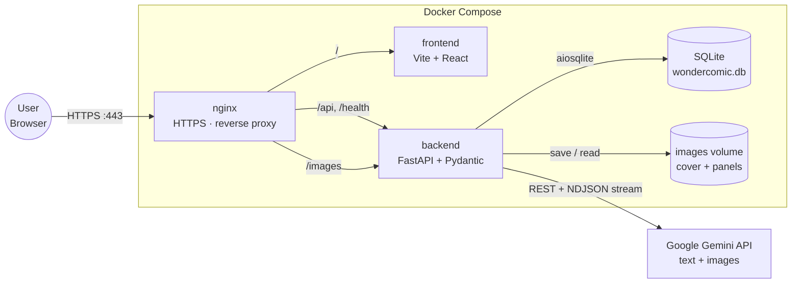
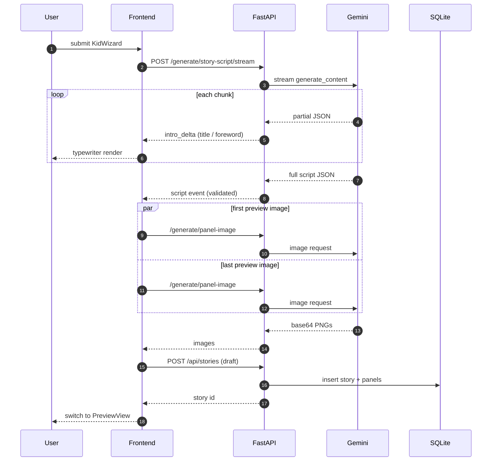
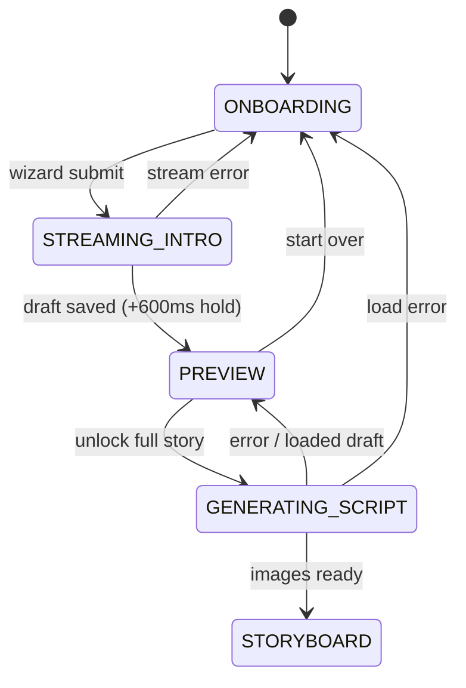

# Architecture

## System Topology

The stack runs as three Docker Compose services behind nginx. nginx terminates TLS and fans requests out by prefix: `/api`, `/health`, and `/images` reach FastAPI, everything else reaches the Vite dev server. FastAPI owns every side effect — SQLite writes, the images volume, and all Gemini calls — so the frontend never talks to external services directly.



## Story Generation Flow

From a completed `KidWizard` to the `PreviewView`, the frontend streams the story intro as it is written, generates the first and last preview images in parallel, and persists a draft before flipping to the storybook. The streaming endpoint is the only interactive piece; everything else is classic request/response.



## Frontend View States

`MainPage` drives the whole experience with a five-state machine (`frontend/components/MainPage.tsx:15`). There are two entry points into the graph: a fresh visit to `/` drops the user in `ONBOARDING`, while a deep link to `/book/:id` jumps straight into `GENERATING_SCRIPT` and then branches based on whether the loaded story is a draft or fully illustrated.



Notes:

- `STREAMING_INTRO` renders `StoryIntroStream.tsx` and is held on screen for at least 600 ms after the last delta, so the typewriter text does not vanish the instant Gemini finishes.
- `GENERATING_SCRIPT` is reused as a generic "busy" state for both full-story generation (after preview unlock) and deep-link hydration — the successor state depends on which one kicked it off.
- `STORYBOARD` has no coded exit transition; the user leaves it by navigating away via React Router (e.g. header logo, `My Library` link), which unmounts `MainPage` entirely.

## Tech Stack

| Layer | Technology | Why |
|-------|-----------|-----|
| Frontend framework | React 19 + Vite 6 + TypeScript 5.8 | Fast HMR, component ecosystem, strong typing |
| Routing | React Router v7 | SPA client-side routing |
| Styling | Tailwind CSS | Utility-first, rapid iteration, CDN for dev |
| Animation | Framer Motion | Page transitions, loading states |
| Backend framework | FastAPI (Python 3.13+) | Async-native, Pydantic validation, auto OpenAPI docs |
| Database | SQLite via aiosqlite | Zero-setup, WAL mode for concurrent reads |
| Auth | JWT (PyJWT) + bcrypt (passlib) | Stateless tokens, industry-standard password hashing |
| AI | Google Gemini API | Story scripts + panel image generation |
| HTTPS | nginx (reverse proxy + TLS) | Mandatory per subject; terminates TLS in front of both services |
| Containerization | Docker Compose | Single-command startup as required by subject |

### Justifications

- **FastAPI over Django/Flask:** Native async, Pydantic v2 built-in for request validation, automatic OpenAPI docs, Python 3.13 compatible.
- **SQLite:** Zero setup overhead; WAL mode enables concurrent reads. Sufficient for the project scope — no distributed deployment needed.
- **JWT over server sessions:** Stateless, works across Docker services without shared session storage.
- **Gemini API:** Supports both text (story scripts) and image generation in a single SDK; rate limiting handled with exponential backoff.

## Database Schema

```
users
├── id            INTEGER PRIMARY KEY AUTOINCREMENT
├── email         TEXT UNIQUE NOT NULL
├── username      TEXT UNIQUE NOT NULL
├── password_hash TEXT NOT NULL          ← bcrypt via passlib
├── avatar_path   TEXT                   ← stored in backend/images/avatars/
├── is_online     BOOLEAN DEFAULT 0
├── created_at    TIMESTAMP DEFAULT CURRENT_TIMESTAMP
└── updated_at    TIMESTAMP DEFAULT CURRENT_TIMESTAMP

friendships
├── id            INTEGER PRIMARY KEY AUTOINCREMENT
├── requester_id  INTEGER NOT NULL REFERENCES users(id) ON DELETE CASCADE
├── addressee_id  INTEGER NOT NULL REFERENCES users(id) ON DELETE CASCADE
├── status        TEXT CHECK(status IN ('pending','accepted', 'rejected', 'blocked'))
└── created_at    TIMESTAMP DEFAULT CURRENT_TIMESTAMP

kid_profiles
├── id            INTEGER PRIMARY KEY AUTOINCREMENT
├── user_id       INTEGER NOT NULL REFERENCES users(id) ON DELETE CASCADE
├── name          TEXT NOT NULL
├── gender        TEXT NOT NULL CHECK(gender IN ('boy','girl','neutral'))
├── skin_tone     TEXT NOT NULL
├── hair_color    TEXT NOT NULL
├── eye_color     TEXT NOT NULL
├── favorite_color TEXT NOT NULL
├── dream         TEXT
├── archetype     TEXT
├── art_style     TEXT
└── created_at    TIMESTAMP DEFAULT CURRENT_TIMESTAMP

stories
├── id                   INTEGER PRIMARY KEY AUTOINCREMENT
├── user_id              INTEGER NOT NULL REFERENCES users(id) ON DELETE CASCADE
├── kid_profile_id       INTEGER NOT NULL REFERENCES kid_profiles(id) ON DELETE CASCADE
├── title                TEXT
├── foreword             TEXT
├── character_description TEXT
├── cover_image_prompt   TEXT
├── cover_image_path     TEXT
├── created_at           TIMESTAMP DEFAULT CURRENT_TIMESTAMP
└── updated_at           TIMESTAMP DEFAULT CURRENT_TIMESTAMP

panels
├── id           INTEGER PRIMARY KEY AUTOINCREMENT
├── story_id     INTEGER NOT NULL REFERENCES stories(id) ON DELETE CASCADE
├── panel_order  INTEGER NOT NULL
├── text         TEXT NOT NULL
├── image_prompt TEXT
├── image_path   TEXT
└── created_at   TIMESTAMP DEFAULT CURRENT_TIMESTAMP
       UNIQUE(story_id, panel_order)
```

**Key changes from scaffold:** `user_id` in `kid_profiles` and `stories` changed from `TEXT DEFAULT 'local-user'` to `INTEGER NOT NULL REFERENCES users(id)`. All story/profile data is now user-scoped.

## Streaming Story Intro

The character wizard kicks off story generation through a streaming endpoint so the title and foreword appear character-by-character instead of after a multi-second blocking call.

### Backend

`POST /api/generate/story-script/stream` (`backend/routers/generation.py:183`) returns a **newline-delimited JSON (NDJSON)** body, `Content-Type: application/x-ndjson`, with `X-Accel-Buffering: no` so nginx does not hold chunks back. Every line is one of:

| `type` | Payload | Emitted |
|--------|---------|---------|
| `intro_delta` | `{field: "title" \| "foreword", delta: "..."}` | Each time new characters of the title or foreword arrive from Gemini |
| `script` | `{script: GenerateStoryScriptResponse}` | Once Gemini finishes and the full JSON document has been validated with Pydantic |
| `error` | `{message: "..."}` | If Gemini fails mid-stream — headers are already on the wire, so a plain HTTP 5xx is no longer possible |

Gemini returns the story as a single JSON document, so the backend runs a tiny JSON state machine (`backend/llm/streaming.py::StoryIntroStreamer`) over the raw text as it arrives. The streamer watches for the opening quotes of `title` and `foreword` in order and yields decoded `IntroDelta` events for each chunk. It only handles plain top-level string fields in a fixed order — that is enough for this use case and avoids pulling in a general-purpose streaming JSON parser.

`generate_story_script_stream` (`backend/llm/gemini_service.py:181`) is deliberately **not** wrapped in the shared `with_retry` helper: once the first byte has been shipped to the client, Gemini cannot be retried transparently. The non-streaming `generate_story_script` path is still used by `POST /api/stories/generate`, which keeps retry semantics for the server-side generate-and-save flow.

### Frontend

`frontend/services/generationApi.ts::streamStoryScript` reads the NDJSON response via `ReadableStream`, splits on newlines, and dispatches each event. `intro_delta` events are funnelled through a small smoothing helper that forwards roughly two characters every 22 ms, so bursty Gemini chunks still look like a steady typewriter. The function resolves with the fully parsed script once the `script` event arrives, and rejects if the stream ends without one or emits an `error`.

`useStoryGenerator.generateStoryPreviewStreaming` (`frontend/hooks/useStoryGenerator.ts`) hides the rest: after the script lands it generates the first and last preview images in parallel, saves the draft story, and only then lets `MainPage` flip to the storybook preview. `MainPage` adds a `STREAMING_INTRO` state that renders `StoryIntroStream.tsx` — a centred card with a blinking caret while deltas are arriving and a short "preparing preview" animation afterwards. A 600 ms minimum hold keeps the intro on screen briefly after streaming completes so the user can finish reading before pages turn.
